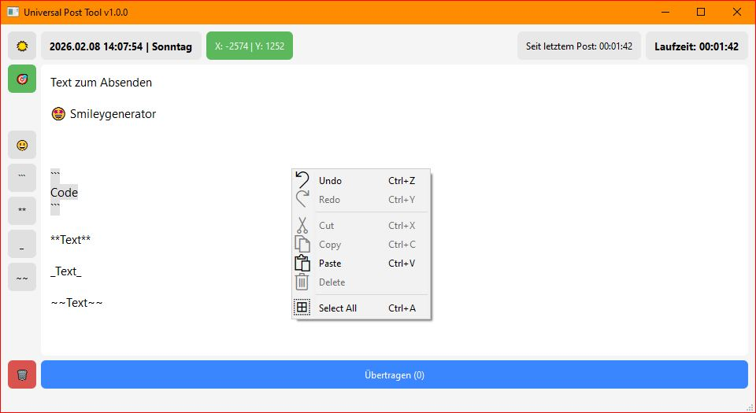

# Universal Post Tool

Ein lokales Python-basiertes GUI-Tool zur Generierung deutscher ISO-ähnlicher Zeitstempel und deren Einfügung in Text für Clipboard-basierte Posts.



## Was ist das Universal Post Tool?

- **Automatische Zeitstempel-Generierung**: Erstellt deutsche Zeitstempel im Format `YYYY.MM.DD HH:MM:SS | Wochentag`
- **Clipboard-Integration**: Kopiert Text mit Zeitstempel automatisch in die Zwischenablage
- **GPT-Integration**: Automatisches Einfügen und Absenden in ChatGPT (oder andere Anwendungen)
- **Live-Vorschau**: Zeigt den aktuellen Zeitstempel in Echtzeit an
- **Formatierungsunterstützung**: Unterstützt Markdown-Formatierung (Code-Blöcke, Fett, Kursiv, Durchgestrichen)
- **Emoji-Picker**: Schneller Zugriff auf Windows-Emoji-Picker

## Installation

```bash
# Repository klonen
git clone https://github.com/tnt-nitro/universal_post_tool.git
cd universal_post_tool/script/universal_post_tool

# Virtuelles Environment erstellen
python -m venv .venv

# Dependencies installieren
# Windows:
.venv\Scripts\activate
pip install -e .

# Linux/Mac:
source .venv/bin/activate
pip install -e .
```

## Bedienung

### 1. Ziel festlegen (🎯 Button)

- Klicken Sie auf den **🎯 Button** (Ziel-Button) links oben
- Ein **3-Sekunden-Countdown** startet automatisch
- Nach dem Countdown haben Sie **10 Sekunden Zeit**, um auf das Eingabefeld in ChatGPT (oder einer anderen Anwendung) zu klicken
- Die Position wird gespeichert und der Status wechselt auf grün: **"X: [X-Koordinate] | Y: [Y-Koordinate]"**
- Das Ziel ist nun gesetzt und bleibt gespeichert

### 2. Text schreiben

- Sobald das Ziel gesetzt ist, können Sie im **Textfeld** Ihren Post-Text eingeben
- Der **Übertragen-Button** wird aktiviert, sobald Text vorhanden ist
- Sie sehen eine **Live-Vorschau** des Zeitstempels oben in der Leiste

### 3. Absenden (Übertragen-Button)

- Klicken Sie auf den **"Übertragen"**-Button
- Der Button zeigt einen **Countdown**: "Einfügen…" → "3" → "2" → "1" → "Absenden…"
- Das Tool führt automatisch folgende Schritte aus:
  1. Zeitstempel wird generiert
  2. Text wird mit Zeitstempel kombiniert: `[Zeitstempel]\n\n[Ihr Text]`
  3. Inhalt wird in die Zwischenablage kopiert
  4. Automatisches Einfügen (Strg+V) am gespeicherten Ziel
  5. Automatisches Absenden (Enter)
- Nach erfolgreichem Absenden wird der Button **grün** und zeigt die Anzahl der Übertragungen: "Übertragen (1)"

### 4. Was Sie im Post erwarten können

Der generierte Post enthält:
- **Zeitstempel im Format**: `2024.01.15 14:30:45 | Montag`
- **Zwei Leerzeilen** nach dem Zeitstempel
- **Ihr eingegebener Text** darunter

**Beispiel:**
```
2024.01.15 14:30:45 | Montag

Das ist mein Post-Text.
```

### 5. Laufzeiten

- **Laufzeit-Anzeige**: Zeigt die Zeit seit Programmstart (Format: `HH:MM:SS`)
- **Post-Timer**: Zeigt die Zeit seit dem letzten erfolgreichen Post (Format: `HH:MM:SS`)
- Beide Timer aktualisieren sich automatisch jede Sekunde

### 6. Papierkorb (🗑️ Button)

- Der **🗑️ Button** löscht den gesamten Text im Textfeld
- Der Button ist nur aktiv, wenn Text vorhanden ist
- Nach dem Löschen werden alle Zähler und Status zurückgesetzt

### 7. Formatierungs-Buttons

Links neben dem Textfeld finden Sie Formatierungs-Buttons:

- **😃 Emoji-Button**: Öffnet den Windows-Emoji-Picker (WIN + .) - *nur Windows*
- **``` Code-Button**: Fügt einen Code-Block ein
- **** Fett-Button**: Fügt Markdown-Fettformatierung (`**text**`) ein
- **_ Kursiv-Button**: Fügt Markdown-Kursivformatierung (`_text_`) ein
- **~~ Durchgestrichen-Button**: Fügt Markdown-Durchgestrichen (`~~text~~`) ein

**Tipp**: Markieren Sie Text vor dem Klicken, um ihn zu formatieren. Ohne Markierung werden Platzhalter eingefügt.

## Weitere Features

- **Theme-Umschaltung**: ☀️/🌙 Button zum Wechseln zwischen Light- und Dark-Mode
- **Code-Highlighting**: Automatische Syntax-Hervorhebung in Code-Blöcken
- **Statusbar**: Zeigt den Zeitstempel des letzten erfolgreichen Posts
- **Persistente Konfiguration**: Gespeicherte Ziel-Position bleibt erhalten

## Systemanforderungen

### Windows
- Windows 10/11
- Python 3.8 oder höher
- PySide6 (GUI)
- pynput (Maus-Position-Erkennung)
- pyautogui (Automatisierung)

### Linux (experimentell)
- Linux mit X11 oder Wayland
- Python 3.8 oder höher
- PySide6 (GUI) - benötigt X11/Wayland
- pynput (Maus-Position-Erkennung) - benötigt X11
- pyautogui (Automatisierung) - benötigt X11
- **Hinweis**: Emoji-Picker funktioniert nur unter Windows. Alle anderen Funktionen sollten unter Linux funktionieren.

## Lizenz

Siehe [LICENSE](LICENSE) Datei für Details.
